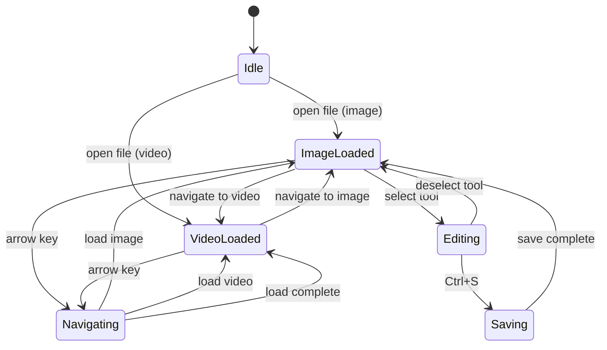

# madOS Photo Viewer - Diagrams

## Application Startup Flow

```
┌─────────────────────────────────────────────────────────────┐
│                        START                                 │
└─────────────────────────┬───────────────────────────────────┘
                          │
                          ▼
┌─────────────────────────────────────────────────────────────┐
│ python3 -m mados_photo_viewer [optional_file_path]          │
└─────────────────────────┬───────────────────────────────────┘
                          │
                          ▼
┌─────────────────────────────────────────────────────────────┐
│ __main__.main()                                             │
│   - Parse command line arguments                            │
│   - Create PhotoViewerApp instance                          │
└─────────────────────────┬───────────────────────────────────┘
                          │
                          ▼
┌─────────────────────────────────────────────────────────────┐
│ PhotoViewerApp.__init__()                                    │
│   - apply_theme()                                            │
│   - detect_system_language()                                │
│   - Create FileNavigator                                    │
│   - set_default_size(900, 700)                              │
└─────────────────────────┬───────────────────────────────────┘
                          │
          ┌───────────────┼───────────────┐
          ▼               ▼               ▼
   ┌─────────────┐ ┌─────────────┐ ┌─────────────┐
   │_build_      │ │_build_      │ │_build_      │
   │ toolbar()   │ │edit_options │ │content_area│
   │             │ │_bar()       │ │()          │
   └─────────────┘ └─────────────┘ └─────────────┘
          │               │               │
          └───────────────┼───────────────┘
                          ▼
┌─────────────────────────────────────────────────────────────┐
│ self.show_all()                                              │
│ self._edit_options_bar.set_visible(False)                   │
│ (if initial_file) self._open_file(initial_file)             │
│ Gtk.main()                                                   │
└─────────────────────────────────────────────────────────────┘
```

## File Loading Flow

```
┌─────────────────────────────────────────────────────────────┐
│ _open_file(filepath)                                         │
└─────────────────────────┬───────────────────────────────────┘
                          │
                          ▼
┌─────────────────────────────────────────────────────────────┐
│ os.path.isfile(filepath)?                                    │
└─────────────────────────┬───────────────────────────────────┘
                    YES / \ NO
                       /   \
                      ▼     ▼
         ┌────────────────────┐    ┌────────────────────┐
         │ _navigator.load_   │    │ _show_error       │
         │ directory(filepath)│    │ ("File not found")│
         └─────────┬──────────┘    └────────────────────┘
                   │
                   ▼
┌─────────────────────────────────────────────────────────────┐
│ is_video_file(filepath)?                                     │
└──────────────┬──────────────────┬──────────────────────────┘
         YES   /                  \   NO
              /                    \
             ▼                      ▼
┌─────────────────────┐   ┌─────────────────────┐
│ _show_video(filepath)│   │ _show_image(filepath)│
└─────────────────────┘   └─────────────────────┘
```

## Image Mode Flow

```
┌─────────────────────────────────────────────────────────────┐
│ _show_image(filepath)                                        │
└─────────────────────────┬───────────────────────────────────┘
                          │
                          ▼
┌─────────────────────────────────────────────────────────────┐
│ _video_player.stop()                                         │
│ _current_mode = "image"                                       │
│ _content_stack.set_visible_child_name("image")               │
└─────────────────────────┬───────────────────────────────────┘
                          │
                          ▼
┌─────────────────────────────────────────────────────────────┐
│ _canvas.load_image(filepath)                                 │
│   → ImageCanvas.load_image()                                 │
│     - GdkPixbuf.new_from_file()                              │
│     - Store pixbuf, set zoom=1.0                             │
│     - queue_draw()                                           │
└─────────────────────────┬───────────────────────────────────┘
                          │
         ┌────────────────┴────────────────┐
         │ (success)                       │ (failure)
         ▼                                 ▼
┌─────────────────────┐   ┌─────────────────────┐
│ _update_ui_state()  │   │ _show_error()       │
└─────────────────────┘   └─────────────────────┘
```

## Drawing/Editing Flow

```
┌─────────────────────────────────────────────────────────────┐
│ User selects tool (e.g., TOOL_PAINT)                         │
└─────────────────────────┬───────────────────────────────────┘
                          │
                          ▼
┌─────────────────────────────────────────────────────────────┐
│ _on_tool_toggled(button, tool_id)                           │
│   - Activate tool button                                    │
│   - _canvas.set_tool(tool_id)                               │
│   - Show _edit_options_bar                                  │
│   - Configure size slider (brush or font)                  │
└─────────────────────────┬───────────────────────────────────┘
                          │
                          ▼
┌─────────────────────────────────────────────────────────────┐
│ User draws on canvas (mouse events)                         │
│   canvas._on_button_press() → _on_motion_notify()          │
└─────────────────────────┬───────────────────────────────────┘
                          │
                          ▼
┌─────────────────────────────────────────────────────────────┐
│ _canvas.draw_with_surface()                                 │
│   - Draw original pixbuf                                    │
│   - For each stroke in history: stroke.draw(cr)           │
└─────────────────────────┬───────────────────────────────────┘
                          │
                          ▼
┌─────────────────────────────────────────────────────────────┐
│ On mouse release: _canvas._on_button_release()             │
│   - Finalize stroke, add to history                         │
│   - history.has_edits = True                               │
│   - on_edits_changed callback → _on_edits_changed()       │
│     → _update_title() (adds "*" to title)                   │
└─────────────────────────────────────────────────────────────┘
```

## Save Flow

```
┌─────────────────────────────────────────────────────────────┐
│ _on_save() or _on_save_as()                                │
└─────────────────────────┬───────────────────────────────────┘
                          │
          ┌───────────────┴───────────────┐
          ▼                               ▼
   ┌──────────────────┐        ┌──────────────────┐
   │ _on_save()       │        │ Save As dialog   │
   │ (to original)   │        │ (Gtk.FileChooser) │
   └────────┬─────────┘        └────────┬─────────┘
            │                           │
            └─────────────┬─────────────┘
                          ▼
┌─────────────────────────────────────────────────────────────┐
│ _save_to_file(filepath)                                      │
│   - pixbuf = _canvas.get_pixbuf()                           │
│   - result = compose_edits_onto_pixbuf(pixbuf, history)   │
│   - Determine format from extension                        │
│   - result.savev(filepath, fmt, [...], [...])               │
└─────────────────────────┬───────────────────────────────────┘
                          │
         ┌────────────────┴────────────────┐
         ▼                                 ▼
┌─────────────────────┐   ┌─────────────────────┐
│ Success:            │   │ Error:              │
│ Update status bar   │   │ _show_error()       │
└─────────────────────┘   └─────────────────────┘
```

## Navigation Flow

```
┌─────────────────────────────────────────────────────────────┐
│ _on_prev() or _on_next()                                   │
└─────────────────────────┬───────────────────────────────────┘
                          │
                          ▼
┌─────────────────────────────────────────────────────────────┐
│ _check_unsaved_on_navigate()                                │
│   - If has_edits: show dialog (Save/Discard/Cancel)        │
└─────────────────────────┬───────────────────────────────────┘
                          │
         ┌────────────────┼────────────────┐
         ▼                ▼                ▼
   ┌──────────┐    ┌─────────────┐   ┌──────────┐
   │ SAVE     │    │ DISCARD    │   │ CANCEL   │
   │ (continue)│    │ (continue) │   │ (stop)   │
   └────┬─────┘    └──────┬──────┘   └──────────┘
        │                 │
        ▼                 ▼
┌─────────────────────┐   ┌─────────────────────┐
│ _on_save()          │   │ _canvas.clear_edits()│
│ (synchronous)      │   └─────────────────────┘
└─────────┬───────────┘
          │
          ▼
┌─────────────────────────────────────────────────────────────┐
│ _navigator.go_prev() or go_next()                          │
│   - Returns next/prev filepath                             │
└─────────────────────────┬───────────────────────────────────┘
                          │
                          ▼
┌─────────────────────────────────────────────────────────────┐
│ is_video_file(filepath)?                                    │
│   → _show_video() or _show_image()                         │
└─────────────────────────┬───────────────────────────────────┘
                          │
                          ▼
┌─────────────────────────────────────────────────────────────┐
│ _update_ui_state()                                          │
│   - Update title, status bar, nav buttons                   │
└─────────────────────────────────────────────────────────────┘
```

## Video Playback Flow

```
┌─────────────────────────────────────────────────────────────┐
│ _show_video(filepath)                                        │
└─────────────────────────┬───────────────────────────────────┘
                          │
                          ▼
┌─────────────────────────────────────────────────────────────┐
│ GST_AVAILABLE?                                              │
└──────────────┬────────────────────────┬──────────────────────┘
         YES   /                      \   NO
              /                        \
             ▼                          ▼
┌─────────────────────┐   ┌─────────────────────┐
│ _current_mode =     │   │ _show_error         │
│   "video"           │   │ ("GStreamer not     │
│ _content_stack.    │   │  available")        │
│   set_visible_child │   └─────────────────────┘
│   _name("video")   │
│ _edit_options_bar. │
│   set_visible(False)│
│ _deactivate_all_   │
│   tools()          │
└─────────┬──────────┘
          │
          ▼
┌─────────────────────────────────────────────────────────────┐
│ _video_player.load_video(filepath)                          │
│   → VideoPlayer.load_video()                                │
│     - gst_element_factory_make("playbin")                  │
│     - uri = "file://" + abspath                             │
│     - gst_element_set_state(PLAYING)                        │
└─────────────────────────────────────────────────────────────┘
```

## Keyboard Shortcuts

```
┌─────────────────────────────────────────────────────────────┐
│ _on_key_press(widget, event)                                │
└─────────────────────────┬───────────────────────────────────┘
                          │
         ┌────────────────┼────────────────┐
         ▼                ▼                ▼
   ┌───────────┐    ┌───────────┐    ┌───────────┐
   │ Ctrl+O    │    │ Ctrl+S    │    │ Ctrl+Z    │
   │ → _on_open│    │ → _on_save│    │ → canvas. │
   └───────────┘    └───────────┘    │   undo()  │
                                    └───────────┘
         ┌────────────────┼────────────────┐
         ▼                ▼                ▼
   ┌───────────┐    ┌───────────┐    ┌───────────┐
   │ ← Arrow   │    │ → Arrow   │    │ Space     │
   │ → _on_prev│    │ → _on_next│    │ → video   │
   └───────────┘    └───────────┘    │   play/   │
                                     │   pause   │
                                     └───────────┘
```

## Sequence Diagram: Image Loading

```
┌──────────┐     ┌──────────┐     ┌──────────┐     ┌──────────┐
│  User    │     │   App    │     │ Navigator│     │ Canvas   │
└────┬─────┘     └────┬─────┘     └────┬─────┘     └────┬─────┘
     │               │               │               │
     │ open file    │               │               │
     │──────────────>│               │               │
     │               │               │               │
     │               │ load_directory│               │
     │               │──────────────>│               │
     │               │<──────────────│               │
     │               │               │               │
     │               │ show_image    │               │
     │               │──────────────>│               │
     │               │               │ load_image   │
     │               │               │──────────────>│
     │               │               │<──────────────│
     │               │               │               │
     │               │   update_ui   │               │
     │               │<──────────────│               │
     │               │               │               │
     │  Image displayed              │               │
     │<──────────────│               │               │
     │               │               │               │
```

## Sequence Diagram: Editing

```
┌──────────┐     ┌──────────┐     ┌──────────┐     ┌──────────┐
│  User    │     │   App    │     │ Canvas   │     │ History  │
└────┬─────┘     └────┬─────┘     └────┬─────┘     └────┬─────┘
     │               │               │               │
     │ select paint  │               │               │
     │ tool          │               │               │
     │──────────────>│               │               │
     │               │               │               │
     │               │ set_tool      │               │
     │               │──────────────>│               │
     │               │               │               │
     │  Draw on canvas               │               │
     │──────────────>│               │               │
     │               │               │               │
     │               │ motion notify │               │
     │               │──────────────>│               │
     │               │               │ add_point    │
     │               │               │──────────────>│
     │               │               │<──────────────│
     │               │               │               │
     │               │  queue_draw   │               │
     │               │<──────────────│               │
     │               │               │               │
     │               │ draw_with_    │               │
     │               │ surface       │               │
     │               │──────────────>│               │
     │               │               │               │
```

## Mermaid Diagram: Application State Machine



## Wallpaper Setting Flow

```
┌─────────────────────────────────────────────────────────────┐
│ _on_set_wallpaper()                                         │
└─────────────────────────┬───────────────────────────────────┘
                          │
                          ▼
┌─────────────────────────────────────────────────────────────┐
│ _canvas.history.has_edits?                                   │
└──────────────┬────────────────────────┬────────────────────┘
         YES  /                        \   NO
             /                          \
            ▼                            ▼
┌─────────────────────┐   ┌─────────────────────┐
│ Save to temp file  │   │ Use original file   │
│ ~/.cache/mados-    │   │ as filepath         │
│ wallpaper.png      │   └─────────────────────┘
└────────┬───────────┘
         │
         ▼
┌─────────────────────────────────────────────────────────────┐
│ _detect_compositor()                                        │
│   - Check HYPRLAND_INSTANCE_SIGNATURE env var               │
│   - Return "hyprland" or "sway"                             │
└─────────────────────────┬───────────────────────────────────┘
         ┌───────────────┴───────────────┐
         ▼                               ▼
┌─────────────────────┐   ┌─────────────────────┐
│ "hyprland"         │   │ "sway"             │
│ _set_wallpaper_    │   │ _set_wallpaper_    │
│   hyprland()       │   │   sway()           │
└────────┬───────────┘   └────────┬───────────┘
         │                        │
         ▼                        ▼
┌─────────────────────────────────────────────────────────────┐
│ pkill swaybg && swaybg -i filepath -m fill (hyprland)      │
│ OR swaymsg output * bg filepath fill (sway)                │
└─────────────────────────┬───────────────────────────────────┘
                          │
                          ▼
┌─────────────────────────────────────────────────────────────┐
│ _update_wallpaper_db(filepath)                              │
│   - SQLite: INSERT wallpaper, UPDATE assignment             │
│ _update_sway_config(filepath) or _update_hyprland_config() │
│   - Update config file                                      │
└─────────────────────────────────────────────────────────────┘
```